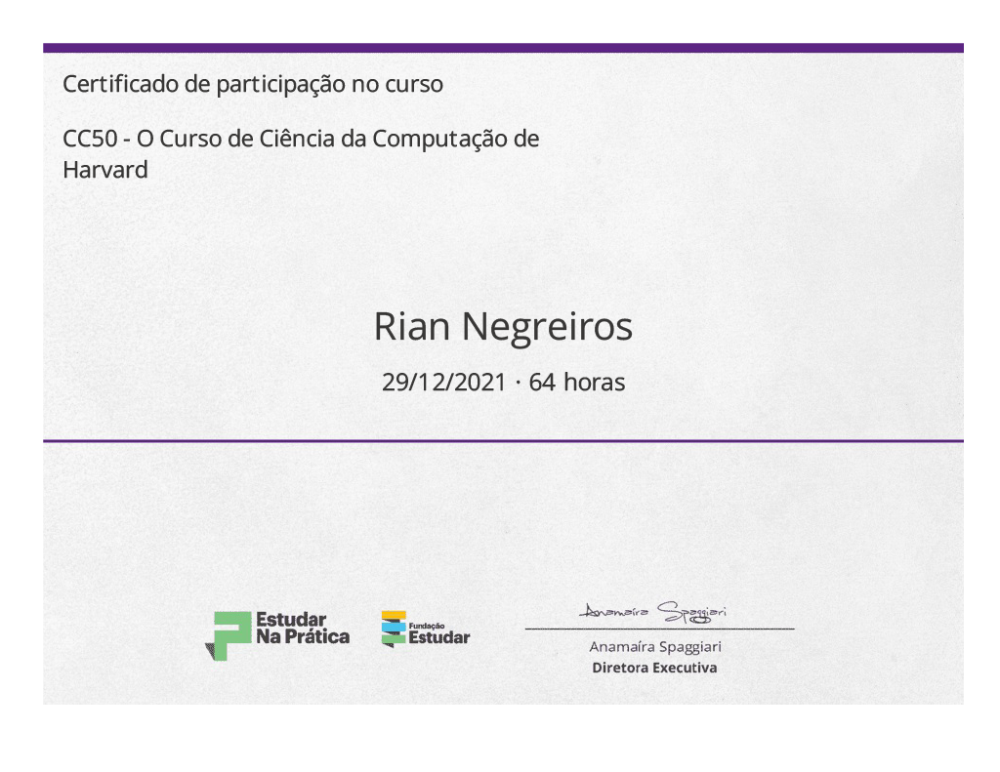

# CC50 é o curso de Harvard, no Brasil!

Esse é o curso básico de ciência da computação da universidade, mas, por ser tão envolvente e instrutivo (os deveres de casa chegam a ser divertidos... De verdade!), e ao mesmo tempo requerer uma dedicação considerável do aluno, já se tornou lendário no campus e fora dele.

O curso é desafiador e exigente mas é plenamente possível de ser feito, não importa se você já tem experiencia em programação ou não.

O CC50 tenta ser o mais fiel possível ao original. Todo o material das aulas e dos Sets de Problemas é traduzido diretamente do material original (CS50 2011). Isso significa que você vai aprender tudo que todos os alunos de Harvard aprendem.

Os alunos aprendem muito sobre como computadores e a internet funcionam, e sobre programação, então após terminar o curso, você terá uma ótima base para inciar seus projetos em Webdesign, Bancos de Dados, Sistemas Eletrônicos, programação de Software, entre outros.

Além disso você aprenderá a pensar algoritmicamente e a enxergar os problemas do mundo real de um novo ponto de vista. Aqui você aprende coisas que com certeza podem ser úteis para alunos de qualquer curso, com qualquer ideal de carreira.

<a href="cc50Certificate.pdf" type="application/pdf">Certificado</a>
